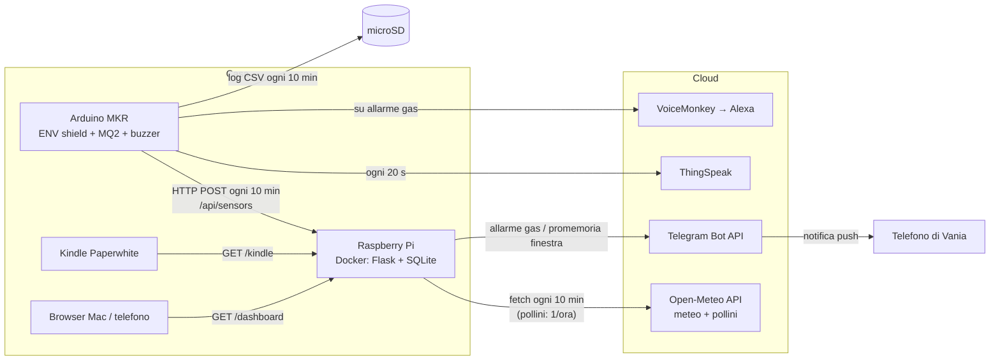
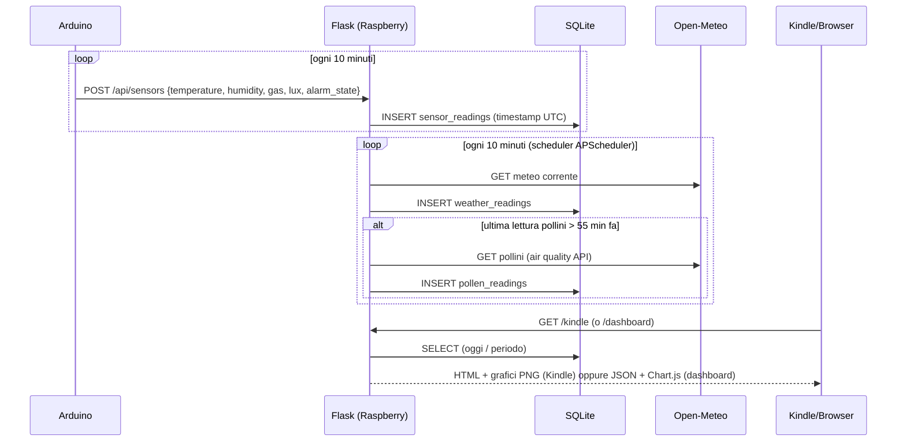
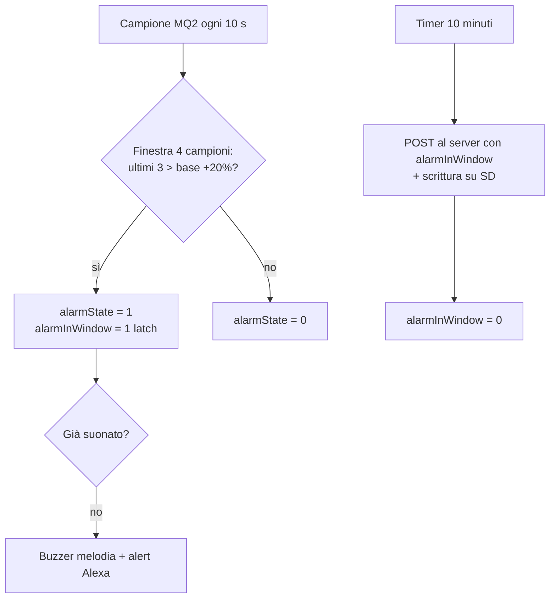

# ack-rokkino — Dashboard sensori casa

Sistema di monitoraggio ambientale domestico: un **Arduino MKR** con shield ENV
e sensore gas MQ2 misura temperatura, umidità, luminosità e gas; un **Raspberry Pi**
raccoglie i dati, li arricchisce con meteo e pollini da Open-Meteo, e li serve su
due pagine web — una ottimizzata per il **Kindle Paperwhite** (e-ink, senza
JavaScript) e una **dashboard interattiva** per browser moderni. Il Raspberry
manda anche **notifiche Telegram**: subito quando scatta l'allarme gas, e un
promemoria "chiudi la finestra" quando, d'estate, l'aria esterna torna a
scaldare dopo un raffrescamento mattutino.

Documentazione:
- [Descrizione funzionale](docs/funzionale.md) — cosa fa il sistema, dal punto di vista di chi lo usa
- [Guida al deploy](docs/deploy.md) — come portare le modifiche sul Raspberry
- [noteVF.md](noteVF.md) — note operative personali (cambio router, ecc.)

## Architettura

## Flusso dei dati

## Logica allarme gas (lato Arduino)

Il controllo del gas avviene **ogni 10 secondi** con una finestra mobile di 4
campioni: se gli ultimi 3 superano del 20% il campione base, scatta l'allarme
(buzzer con melodia + trigger Alexa via VoiceMonkey). Poiché al server i dati
vanno solo ogni 10 minuti, un **latch** (`alarmInWindow`) ricorda se c'è stato
almeno un allarme dall'ultimo invio: è questo valore che finisce nel campo
`alarm_state` del DB e nella linea ALTO/BASSO dei grafici.

## Notifiche Telegram (lato Raspberry)

Due notifiche indipendenti, entrambe inviate da `window_alert.send_telegram_message`
(`server/window_alert.py`), che richiede `TELEGRAM_BOT_TOKEN` e
`TELEGRAM_CHAT_ID` in `server/.env` (vedi `.env.example`; se mancano, la
funzione logga e non invia nulla, senza rompere `/api/sensors`):

1. **Allarme gas**: appena `alarm_state` passa da 0 a 1 in una nuova lettura
   (`app.py`, `_gas_alarm_just_triggered`). Non ripete la notifica finché
   l'allarme resta attivo nelle letture successive; se rientra e poi
   riscatta, notifica di nuovo.
2. **Promemoria "chiudi la finestra"** (`window_alert.check_and_notify`,
   chiamato dopo ogni `POST /api/sensors`): attivo solo quando la temperatura
   esterna è sopra 25°C (d'estate; sotto quella soglia una variazione
   percentuale è instabile ed è un discorso diverso). Stato persistito nella
   tabella `window_events`:
   - **rileva l'apertura** quando l'esterna è più bassa dell'interna *e*
     l'interna mostra un calo sostenuto (non un singolo scatto isolato, per
     non confondere un raggio di sole diretto sul sensore con una finestra
     aperta) su 3 letture consecutive;
   - **avvisa di richiudere** quando l'esterna torna a salire (almeno 2
     rialzi ≥4% su una finestra di 40 minuti — non serve che siano proprio
     gli ultimi due, altrimenti la conferma arriva con troppo ritardo) *e*
     l'interna sale a sua volta su 3 letture consecutive;
   - torna a riposo dopo la notifica (una sola per apertura, niente spam), o
     comunque dopo 6 ore se il ciclo non si chiude mai.

## Componenti

| Percorso | Ruolo |
|---|---|
| `arduino/sketch/sketch.ino` | Sketch MKR: sensori, allarme, ThingSpeak, SD, POST al server |
| `arduino/arduino_secrets.h.example` | Template dei segreti (WiFi, chiavi, IP server) — la copia reale è gitignorata |
| `server/app.py` | App Flask: route web + API, avvio scheduler |
| `server/db.py` | SQLite: schema, insert, query per periodo, media giornaliera pollini |
| `server/weather.py` | Client Open-Meteo (meteo + pollini) + job APScheduler |
| `server/window_alert.py` | Rilevazione "finestra aperta" + promemoria Telegram quando richiuderla |
| `server/charts.py` | Grafici PNG con matplotlib per la pagina Kindle (b/n, e-ink) |
| `server/templates/kindle.html` | Pagina statica per Kindle: no JS, `<meta refresh>` 10 min |
| `server/templates/dashboard.html` | Dashboard Chart.js con selettore periodo, tabelle ultimi dati, etichette valore sui grafici |
| `server/static/chart.min.js` | Chart.js 4.4.1 in locale (funziona senza internet) |
| `server/Dockerfile` + `docker-compose.yml` | Container (python:3.12-slim, multi-arch ARM) |
| `server/.env.example` | Template variabili d'ambiente (token/chat id Telegram) — la copia reale (`.env`) è gitignorata |

## Schema database (SQLite, `server/data/sensors.db`)

Tutti i timestamp sono ISO8601 in UTC; la conversione in ora italiana avviene
in fase di visualizzazione.

- **sensor_readings**: `id, timestamp, temperature, humidity, gas (MQ2 grezzo), lux, alarm_state (0/1, "almeno un allarme negli ultimi 10 min")`
- **weather_readings**: `id, timestamp, temperature, humidity, description (it)`
- **pollen_readings**: `id, timestamp, grass, birch, alder, mugwort, olive, ragweed` (grani/m³, specie CAMS)
- **window_events**: `id, timestamp, event` (`opened` / `closed_notified` / `expired`) — stato del promemoria "chiudi la finestra", vedi sotto

Il DB vive fuori dal container (volume `./data:/app/data`): sopravvive a
rebuild e riavvii. Nessuna retention: i dati si accumulano indefinitamente.

## API

| Endpoint | Descrizione |
|---|---|
| `POST /api/sensors` | Riceve il JSON dall'Arduino, valida i 5 campi, salva con timestamp corrente |
| `GET /kindle` | Pagina e-ink: tabelle valori attuali + 5 grafici PNG |
| `GET /dashboard` | Dashboard interattiva Chart.js |
| `GET /api/data?period=today\|week\|month` | JSON per la dashboard (sensori + meteo, downsampling a ~500 punti; pollini sempre media giornaliera 15 gg) |
| `GET /api/latest?limit=15` | JSON con le ultime N letture grezze (sensori + meteo), senza downsampling — alimenta le tabelle "Ultimi dati registrati" della dashboard |
| `GET /chart/<metric>.png` | PNG per il Kindle; `metric` = `temperature`, `humidity`, `gas`, `lux`, `pollen` |

## Scelte tecniche principali

- **Porta 5001 ovunque** (Mac in sviluppo e Raspberry in produzione): sul Mac la
  5000 è occupata da AirPlay Receiver; tenere la stessa porta evita di dover
  mai cambiare `SERVER_PORT` nello sketch.
- **Pollini = media giornaliera** degli ultimi 15 giorni: è lo standard dei
  bollettini pollinici, confrontabile con le soglie di rischio (graminacee:
  bassa <30, media 30–49, alta 50–149 grani/m³).
- **Grafici Kindle come PNG matplotlib**: il browser del Paperwhite non regge
  librerie JS moderne; PNG in bianco e nero con linee differenziate
  (continua/tratteggiata/puntinata) al posto dei colori.
- **Chart.js con asse X numerico** (epoch ms): sensori (10 min) e meteo (1 h)
  hanno densità diverse; l'asse a categorie li disallineerebbe.
- **Etichette valore sui grafici della dashboard**: oltre alla linea, i
  grafici mostrano pallini + valore numerico sui massimi/minimi locali e
  sull'ultima misura (non solo al passaggio del mouse). La densità si adatta
  alla larghezza reale del grafico e al tipo di dispositivo (touch = mobile,
  non solo la larghezza della finestra, che si sbaglierebbe con un telefono
  ruotato in orizzontale); su schermi stretti settimana/mese raggruppano per
  calendario (ogni 2 e ogni 6 giorni) invece che per densità di punti.
  **Nota**: la densità su mobile non è ancora considerata soddisfacente da
  Vania, da rivedere ulteriormente (vedi `noteVF.md`).
- **Segreti fuori da git**: tutto ciò che è sensibile sta in
  `arduino_secrets.h` e in `server/.env` (entrambi gitignorati ovunque); nel
  repo ci sono solo i rispettivi template (`.example`).
